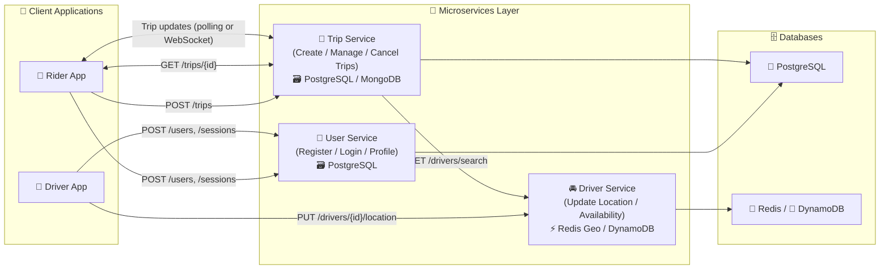
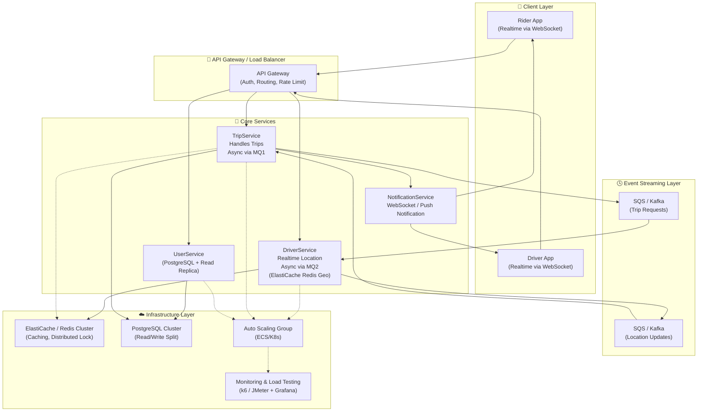
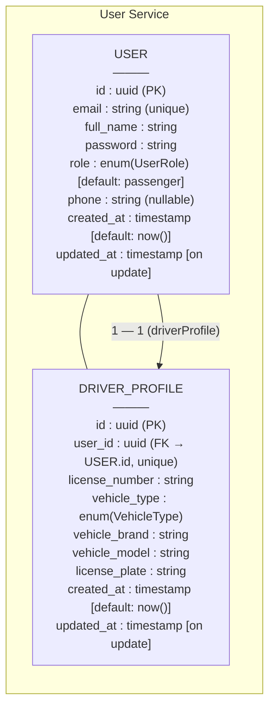
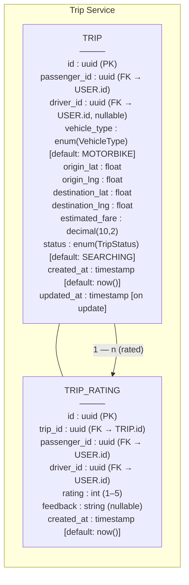

# ARCHITECTURE.md

## 1. Sơ đồ Kiến trúc Tổng Quan

### 🔍 Mô tả:

* **UserService**: Quản lý thông tin người dùng và xác thực.
* **TripService**: Xử lý logic đặt chuyến, tìm tài xế, cập nhật trạng thái chuyến.
* **DriverService**: Quản lý vị trí và trạng thái của tài xế, phục vụ tìm kiếm tài xế gần.
* **Redis Geo**: Lưu vị trí tài xế theo tọa độ, cho phép truy vấn tài xế gần trong bán kính rất nhanh.
* **Message Queue**: Dùng để giao tiếp bất đồng bộ giữa các service, giúp hệ thống chịu được tải cao.

Hệ thống tuân thủ nguyên tắc **Database per Service**, giúp đảm bảo tính độc lập, dễ mở rộng và giảm rủi ro khi một service gặp sự cố.

---

## 2. Sơ đồ Chi tiết cho Module A - Scalability & Performance

### ⚙️ Mô tả:

* **TripService** nhận yêu cầu đặt xe, đẩy event sang **Redis Stream/SQS** để xử lý bất đồng bộ → tránh nghẽn khi có lượng lớn request đồng thời.
* **DriverService** tiêu thụ event từ hàng đợi, cập nhật vị trí tài xế vào **Redis Geo** → hỗ trợ tìm kiếm tài xế gần với độ trễ thấp (<10ms).
* Dữ liệu vị trí được ghi vào Redis trước (in-memory) và được **batch đồng bộ** về **PostgreSQL** định kỳ để lưu lâu dài.
* **Cache Layer** giúp giảm tải cho CSDL khi truy vấn thông tin tài xế hoặc kết quả tìm kiếm gần đây.
* Tích hợp **Prometheus** và **Jaeger** để quan sát hiệu năng (metrics & tracing) phục vụ kiểm chứng load testing.

### 🚀 Mục tiêu thiết kế:

* Đảm bảo hệ thống chịu tải tốt khi lượng đặt xe tăng đột biến (spike load).
* Giảm độ trễ tìm tài xế trung bình xuống < 200ms (p95 latency).
* Hỗ trợ mở rộng ngang (horizontal scaling) với DriverService và TripService độc lập.

---

## 3. Data Schema
### 3.1 User-service schema

### 3.2. Trip-service schema

> **Tóm lại:**
>
> * Phần 1 thể hiện kiến trúc tổng thể của hệ thống UIT-Go (3 service + DB + Redis + Queue).
> * Phần 2 mô tả chi tiết module chuyên sâu (Scalability & Performance) với luồng *Find Driver / Update Location*, tập trung vào khả năng mở rộng và hiệu năng truy vấn.
